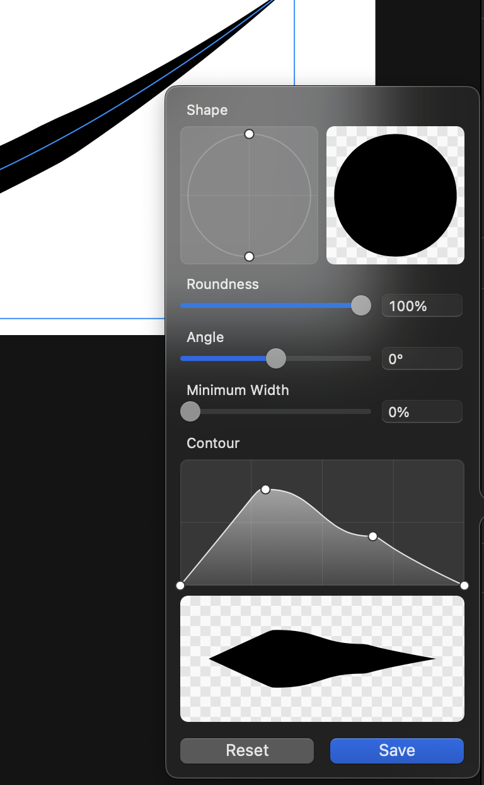

# PowerStroke

## Curve 44

- abstractPath - brushStrokeCGPaths にある base64bplist (冗長？), 14 と 44 で共通

```json
{
    "UIBezierPathHasContinuousCornersKey": False,
    "UIBezierPathIsRoundedRectKey": False,
    "UIBezierPathMiterLimitKey": 10.0,
    "UIBezierPathLineJoinStyleKey": 0,
    "UIBezierPathCornerRadiusKey": 0.0,
    "UIBezierPathCGPathDataKey": "消しました",
    "UIBezierPathCornerMaskKey": 0,
    "UIBezierPathLineWidthKey": 1.0,
    "UIBezierPathLineDashPhaseKey": 0.0,
    "UIBezierPathFlatnessKey": 0.6000000238418579,
    "UIBezierPathLineCapStyleKey": 0,
    "UIBezierPathLineDashPatternCountKey": 0,
    "UIBezierPathUsesEvenOddFillRuleKey": False
}
```

- brushStrokeId - brushProfileId - brushProfiles (良さげな方)

```json
{
  "angle": 0,
  "containsPressure": false,
  "handles": [
    [0, 0],
    [0.7301962209302325, 0.5308593749999999],
    [1, 0.1363002232142856],
    [1, 0.1363002232142856],
    [1, 0.13775111607142854],
    [1, 0.1363002232142856]
  ],
  "minimumWidth": 0,
  "roundness": 1
}
```

## Vectornator 14

abstractPath ではなく, pathData 以下の subElement: neither 内にある

この subElement も`_0`を使わないので結構マズイ

"stroke": はさっきの brushStrokeCGPaths と同じ

Vectornator では compound な brush は不可能？例がないので検証不可



```json
"brushProfile": {
    "handles": [
        [
            0, // x direction (position)
            0  // y direction (width)
        ],
        [
            0.3001836197339246,
            0.762734375
        ],
        [
            0.677730044345898,
            0.39078124999999997
        ],
        [
            1,
            0
        ]
    ],
    "containsPressure": false,
    "minimumWidth": 0,
    "roundness": 1,
    "angle": 0
}
```

# \_1???????????

固定じゃないのか！？？？

```json
"pathData": {
    "_0": {
        "nodes": [deleted],
        "reversed": false,
        "closed": true,
        "subElement": {
            "shape": {
                "_1": {
                    "maximumPressureValue": 0,
                    "stroke": "Redacted",
                    "initialPoints": [],
                    "distancesOfInitialPath": [
                        0
                    ],
                    "brushProfile": {
                        "handles": [
                            [
                                0,
                                0
                            ],
                            [
                                0.3001836197339246,
                                0.762734375
                            ],
                            [
                                0.677730044345898,
                                0.39078124999999997
                            ],
                            [
                                1,
                                0
                            ]
                        ],
                        "minimumWidth": 0,
                        "containsPressure": false,
                        "roundness": 1,
                        "angle": 1.8441280126571655
                    },
                    "pressureValues": [],
                    "lengthOfInitialPath": 0,
                    "length": 1200
                },
                "_0": {
                    "endPoint": [
                        700,
                        425
                    ],
                    "initialPoint": [
                        450,
                        74.99999999999999
                    ],
                    "additionalValue": {
                        "rectangle": {
                            "cornerRadius": 0
                        }
                    }
                }
            }
        }
    }
}
```


# ではなぜ上手くいかない？
## なぜクラッシュ?
単純なことで、パスを事前にpopしているから。
corners LPEが使われるpathでクラッシュしている

corners LPEのパスが出てこないことにはlpeを適用できないというわけだ
じゃあどうするって...
残しておいて最後にpopすればいい話
cornersがなくてもその値を推測できる！！！

## なぜ重いのか
Vectornator, non-transform Curveでは`CubicBezierSmooth`ではとてつもなく重い・そもそも動かないことがある

これは`CubicBezierJohan`で回避できるが1番いい方法ではないと思う

Curve 44ではtransformが適用されていないpathGeometryを保持しているため、
後でtransformを適用する際にクリーンアップされている可能性はある
実際これで超絶重い現象は回避されている

ならクリーンアップにはtransformを一旦キャンセルして適用、それからもう一回適用すればいいのか？
(Very hacky, rough solution)
結局上手くいかなかった